# 🤝 Guia de Coordenação - Backend ↔ Frontend

## 📋 Sequência de Implementação Coordenada

### 🎯 Prioridade de Execução

**⚠️ ORDEM CRÍTICA**: O Backend deve implementar PRIMEIRO, Frontend segue depois.

```mermaid
gantt
    title Cronograma de Implementação
    dateFormat X
    axisFormat %d
    
    section Backend
    Fase 1 - Fundação    :b1, 0, 3d
    Fase 2 - Integração  :b2, after b1, 2d
    Fase 3 - Testes      :b3, after b2, 1d
    
    section Frontend  
    Esperar Backend      :f0, 0, 5d
    Fase 1 - Tipos       :f1, after b2, 1d
    Fase 2 - Componentes :f2, after f1, 3d
    Fase 3 - Integração  :f3, after f2, 2d
    
    section Validação
    Testes Integrados    :v1, after f3, 2d
```



## 🔗 Pontos de Integração Críticos

### 1. **Endpoint de Compatibilidade** (Backend → Frontend)

**Backend deve expor PRIMEIRO**:
```
GET  /api/v1/credentials/{id}/enhanced-test
POST /api/v1/credentials (com campos estendidos)
PUT  /api/v1/credentials/{id} (com campos estendidos)
```

**Frontend aguarda**: Endpoints estarem funcionais antes de implementar validação estendida.

### 2. **Estrutura de Dados** (Sincronização Crítica)

**Backend define** (models/credential_models.py):
```python
class EnhancedCredentialConfig:
    access_pattern: AccessPattern
    credential_type: CredentialType
    data_role_arn: Optional[str]
    api_role_arn: Optional[str]
    external_id: Optional[str]
```

**Frontend replica** (types/credentials.ts):
```typescript
interface EnhancedAWSCredentials {
    access_pattern: AccessPattern;
    credential_type: CredentialType;
    data_role_arn?: string;
    api_role_arn?: string;
    external_id?: string;
}
```

### 3. **Validação Estendida** (Contrato de API)

**Response Backend**:
```json
{
  "is_valid": true,
  "data_access_valid": true,
  "api_access_valid": true,
  "data_access_info": {
    "can_read_billing": true,
    "accessible_buckets": ["bucket-1"],
    "role_assumed": "arn:aws:iam::123:role/DataRole"
  },
  "api_access_info": {
    "cost_explorer_access": true,
    "support_api_access": false
  }
}
```

**Frontend esperado**:
```typescript
interface EnhancedValidationResult {
  is_valid: boolean;
  data_access_valid?: boolean;
  api_access_valid?: boolean;
  // ... resto igual ao backend
}
```

## 🔄 Checkpoints de Sincronização

### Checkpoint 1: Backend Fase 1 Completa ✅
**Backend entrega:**
- [x] Classes base (`CredentialStrategy`, `AccessPattern`, `CredentialType`)
- [x] Factory pattern funcionando
- [x] Estratégia AWS básica implementada
- [x] Adapter de compatibilidade criado

**Frontend pode começar:**
- [ ] Implementar tipos TypeScript correspondentes
- [ ] Criar componentes básicos (sem integração)

### Checkpoint 2: Backend Fase 2 Completa ✅
**Backend entrega:**
- [x] Endpoint `/enhanced-test` funcionando
- [x] API aceita campos estendidos em POST/PUT
- [x] Compatibilidade com credenciais existentes validada

**Frontend pode começar:**
- [ ] Integrar validação estendida
- [ ] Testar formulários com novos campos
- [ ] Implementar componentes de configuração

### Checkpoint 3: Integração Completa ✅
**Ambos entregam:**
- [ ] Fluxo completo funcionando
- [ ] Testes de ponta a ponta passando
- [ ] Documentação atualizada

## 🧪 Protocolo de Testes

### Testes de Backend (PRIMEIRO)
```bash
# 1. Backend Agent executa
python scripts/test_credential_strategies.py
curl -X POST "/api/v1/credentials/{id}/enhanced-test"

# 2. Verifica se respostas estão corretas
echo "✅ Backend pronto para Frontend"
```

### Testes de Frontend (DEPOIS)
```bash
# 1. Frontend Agent executa
npm run test:components
npm run test:integration

# 2. Verifica integração com Backend
echo "✅ Frontend integrado com Backend"
```

### Testes Integrados (FINAL)
```bash
# 1. Ambos executam juntos
npm run test:e2e
python scripts/test_end_to_end.py

# 2. Validação completa
echo "✅ Sistema dual funcionando"
```

## 🚨 Prevenção de Conflitos

### 1. **Conflitos de Nomenclatura**
**Regra**: Backend define primeiro, Frontend segue exatamente.

```python
# Backend define (AUTORIDADE)
class AccessPattern(Enum):
    DATA_ONLY = "data_only"
    API_ONLY = "api_only" 
    HYBRID = "hybrid"
```

```typescript
// Frontend replica (SEGUIDOR)
enum AccessPattern {
  DATA_ONLY = 'data_only',
  API_ONLY = 'api_only',
  HYBRID = 'hybrid'
}
```

### 2. **Conflitos de Estrutura de Dados**
**Regra**: JSON responses do Backend são contratos imutáveis.

❌ **Não fazer**:
```typescript
// Frontend inventando campos
interface MyCustomValidation {
  custom_field: string; // Backend não conhece
}
```

✅ **Fazer**:
```typescript
// Frontend seguindo backend exatamente
interface EnhancedValidationResult {
  // Exatamente como backend retorna
  is_valid: boolean;
  data_access_valid?: boolean;
  // ...
}
```

### 3. **Conflitos de Versionamento**
**Regra**: Sempre manter compatibilidade com versão anterior.

```python
# Backend - adicionar campos, nunca remover
class CredentialConfigResponse:
    # Campos existentes (MANTER)
    id: str
    name: str
    
    # Campos novos (ADICIONAR)
    access_pattern: Optional[AccessPattern] = None
```

```typescript
// Frontend - campos opcionais para compatibilidade
interface Credential {
  // Campos existentes (MANTER)
  id: string;
  name: string;
  
  // Campos novos (OPCIONAIS)
  access_pattern?: AccessPattern;
}
```

## 📞 Comunicação Entre Agentes

### Mensagens de Status

**Backend → Frontend**:
```
🔧 [BACKEND] Fase 1 completa: Classes base implementadas
🔧 [BACKEND] Endpoint /enhanced-test disponível em http://localhost:8000
🔧 [BACKEND] Pronto para Frontend começar Fase 1
```

**Frontend → Backend**:
```
🎨 [FRONTEND] Aguardando endpoint /enhanced-test
🎨 [FRONTEND] Tipos implementados, aguardando validação
🎨 [FRONTEND] Componentes prontos, iniciando testes
```

### Resolução de Problemas

**Problema típico**: Frontend não consegue conectar com Backend
```
🚨 [FRONTEND] Erro 404 em /enhanced-test
📞 [COMUNICAÇÃO] Backend, endpoint foi implementado?
🔧 [BACKEND] Verificando... endpoint criado mas rota não registrada
🔧 [BACKEND] Corrigido: router.include_router(credentials_router)
✅ [RESOLVIDO] Frontend pode continuar
```

## 📋 Checklist de Entrega Final

### Backend Final Checklist ✅
- [ ] Sistema de estratégias funcionando
- [ ] Adapter de compatibilidade validado
- [ ] Endpoints estendidos funcionais  
- [ ] Testes unitários passando
- [ ] Credenciais existentes não quebradas
- [ ] Documentação técnica atualizada

### Frontend Final Checklist ✅
- [ ] Componentes de interface funcionando
- [ ] Formulários estendidos operacionais
- [ ] Validação visual implementada
- [ ] Filtros avançados funcionais
- [ ] Compatibilidade com UX existente
- [ ] Testes de componente passando

### Integração Final Checklist ✅
- [ ] Fluxo completo: criação → validação → listagem
- [ ] Credenciais antigas continuam funcionando
- [ ] Credenciais novas usam sistema dual
- [ ] Performance mantida ou melhorada
- [ ] Logs e auditoria funcionando
- [ ] Documentação de usuário atualizada

## 🎯 Critérios de Sucesso

### Técnicos
- **Zero Breaking Changes**: Nenhuma funcionalidade existente quebra
- **Compatibilidade**: Credenciais antigas funcionam sem modificação
- **Performance**: Tempo de resposta mantido ou melhorado
- **Segurança**: Roles implementados corretamente

### Funcionais  
- **UX Fluido**: Interface intuitiva para novos recursos
- **Validação Clara**: Feedback visual sobre tipos de acesso
- **Flexibilidade**: Suporte a múltiplos padrões de acesso
- **Documentação**: Guias inline para configuração

### Operacionais
- **Monitoramento**: Logs adequados para debug
- **Auditoria**: Tracking de mudanças em credenciais
- **Backup**: Configurações preservadas
- **Rollback**: Possibilidade de reverter se necessário

---

**🎯 Meta Principal**: Implementar sistema dual de credenciais sem quebrar nada existente, melhorando segurança e flexibilidade da plataforma X Cost.